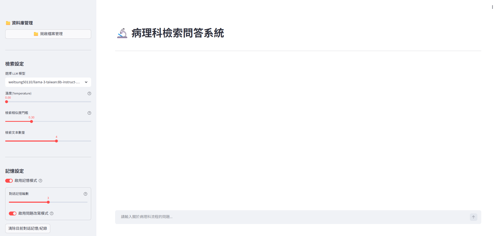

# 🔬 病理科檢索問答系統

面對病理科內部繁雜的作業流程與表單，本專題透過引入檢索增強生成（RAG）技術，開發出這套專屬的醫療文件檢索系統。藉由 LLM 與向量資料庫的整合，系統能自動解析各式文件格式；使用者只需以自然語言提問，系統便會產出附有明確來源的解答，讓醫療知識的查找變得更直覺、更可靠。

## 🌟 系統特色

* **本地化部署**：運用 Ollama 運行本地端 LLM，確保醫療資料的隱私與安全性。
* **多格式文件支援**：支援 `.pdf`, `.docx`, `.doc`, `.csv`, `.xls`, `.xlsx` 等常見病理科文書格式。
* **進階檔案防呆機制**：
  * **加密攔截**：上傳階段主動偵測 PDF 與 Office 檔案是否受密碼保護，提早攔截以避免轉檔程序崩潰。
  * **重複檔案安全阻擋**：自動辨識同名檔案（包含跨副檔名，例如同名的 PDF 與 Word 檔）並阻擋上傳，避免覆蓋錯誤導致重要檢索資料遺失。
  * **無效內容過濾**：自動識別無法提取純文字的檔案（如純圖片組成的掃描檔 PDF），避免寫入無效索引，確保向量資料庫的檢索品質。
  * **視覺化錯誤回報**：針對無法讀取或轉檔失敗的檔案，系統會輸出清晰的失敗清單與具體原因（如：純圖片無法解析、檔案已被加密等），方便管理者後續人工確認。
* **動態向量資料庫**：內建文件管理介面，支援單筆檔案的上傳、更新與刪除，無須每次重新建置整個資料庫。
* **智慧問題改寫**：具備對話記憶功能，能自動將使用者的代名詞替換為完整提問，提升檢索精準度。



---

## 🛠️ 技術架構 

* **網頁互動介面**：使用 **Streamlit** 開發直覺的使用者介面。內建動態轉檔進度條、彈出式檔案管理中心，以及可折疊的參考來源檢視區，提供流暢的操作體驗。
* **語言模型 (LLM)**：透過 **Ollama** 於本地端離線運行大型語言模型（如 Gemma 3 或 Llama 3 Taiwan），確保所有醫療提問與對話紀錄皆在本地端運作，符合嚴格的資安規範。
* **RAG 應用框架**：基於 **LangChain** 框架串接文件讀取、文本切塊（Text Splitter）、以及多輪對話記憶（Memory）功能。
* **向量資料庫 (Vector DB)**：採用 **Chroma (ChromaDB)** 進行文件特徵的儲存與高效相似度檢索，並搭配 `bge-m3` 嵌入模型（Embedding Model），大幅提升繁體中文醫療術語的比對精準度。

---

## 💻 系統環境需求

本示範以 **Windows 11** 作業系統為例，並建議使用 **Anaconda** 進行環境管理。
* **Python 版本**：3.11
* **使用工具**：Anaconda

---

## 🛠️ 環境建置步驟 (Windows 11)

### 步驟一：安裝並設定 Ollama 與本地模型

本系統高度依賴本地端的大型語言模型與嵌入模型（Embedding Model）。請先確保您的電腦已安裝 Ollama。

1.  前往 [Ollama 官方網站](https://ollama.com/) 下載並安裝 Windows 版本。
2.  安裝完成後，開啟「命令提示字元 (CMD)」或「PowerShell」。
3.  拉取（Pull）系統所需的嵌入模型（BGE-M3）：
    ```bash
    ollama pull bge-m3
    ```
4.  拉取專案預設使用的 LLM 模型（可擇一或皆下載）：
    ```bash
    ollama pull gemma3:4b
    ollama pull weitsung50110/llama-3-taiwan:8b-instruct-dpo-q8_0
    ```
    *(註：確保 Ollama 服務在背景持續運行，系統才能順利呼叫模型)*

### 步驟二：建立 Anaconda 虛擬環境

為避免套件版本衝突，建議為本專案建立獨立的虛擬環境。

1.  開啟 **Anaconda Prompt**。
2.  建立名為 `pathology_rag_py3.11` 的虛擬環境，並指定 Python 3.11：
    ```bash
    conda create -n pathology_rag_py3.11 python=3.11 -y
    ```
3.  啟動虛擬環境：
    ```bash
    conda activate pathology_rag_py3.11
    ```

### 步驟三：安裝 Python 依賴套件

本專案使用 LangChain 0.3.x 生態系、Chroma 向量資料庫與 Streamlit 網頁框架。

1.  將終端機路徑切換至本專案資料夾底下。
2.  透過 `requirements_chroma.txt` 一鍵安裝所有依賴套件：
    ```bash
    pip install -r requirements_chroma.txt
    ```

### 步驟四：安裝外部依賴軟體 (LibreOffice)

由於系統內建將舊版 Word 檔案（`.doc`）自動轉換為 `.docx` 的功能，底層需要呼叫 LibreOffice 進行無頭（Headless）轉檔。

1.  前往 [LibreOffice 官方網站](https://zh-tw.libreoffice.org/download/) 下載並安裝最新版軟體。
2.  請確保軟體安裝於系統預設路徑：`C:\Program Files\LibreOffice\program\soffice.exe`。若安裝於其他路徑，需手動修改主程式 `0519_rag_app_v3.py` 中的 `soffice_path` 變數。

---

## 🚀 啟動系統

所有環境與依賴配置完成後，即可啟動檢索問答系統：

1.  確認 Anaconda Prompt 已進入 `pathology_rag_py3.11` 虛擬環境。
2.  確認 Ollama 應用程式已在系統工具列背景執行。
3.  輸入以下指令啟動 Streamlit 網頁服務：
    ```bash
    streamlit run 0519_rag_app_v3.py
    ```
4.  瀏覽器將自動開啟 `http://localhost:8501`。
5.  初次使用時，請點擊左側側邊欄的「📁 開啟檔案管理」，上傳您的病理科相關文件（如流程規範、儀器說明書等），系統便會自動將其進行文本分割並轉換寫入 Chroma 向量資料庫中。

---

## 📂 專案架構說明

* `0519_rag_app_v3.py`：系統主程式，包含 Streamlit UI、LangChain 處理流程與 Chroma 資料庫操作。
* `requirements_chroma.txt`：記錄所有 Python 套件的清單。
* `01_processed_data/`：（自動生成資料夾）存放使用者上傳並轉檔完成的實體檔案。
* `02_db/chroma_db/`：（自動生成資料夾）存放 Chroma 建立的本地向量資料庫檔案。

---

## 🔧 常用狀態檢查與維護指令

在建置環境或後續維護時，可以使用以下指令來確認系統狀態：

### Ollama 相關指令
* **列出已下載的模型**：
  ```bash
  ollama list
  ```

* **查看正在執行中的模型**：
  ```bash
  ollama ps
  ```

* **刪除不需要的模型**：
  ```bash
  ollama rm <模型名稱>
  ```
  
### 虛擬環境與系統檢查
* **查看所有的 Anaconda 虛擬環境**：
  ```bash
  conda env list
  ```

* **檢查顯示卡狀態與 VRAM 使用量 (若有配備 NVIDIA 獨立顯卡）**：
  ```bash
  nvidia-smi
  ```


